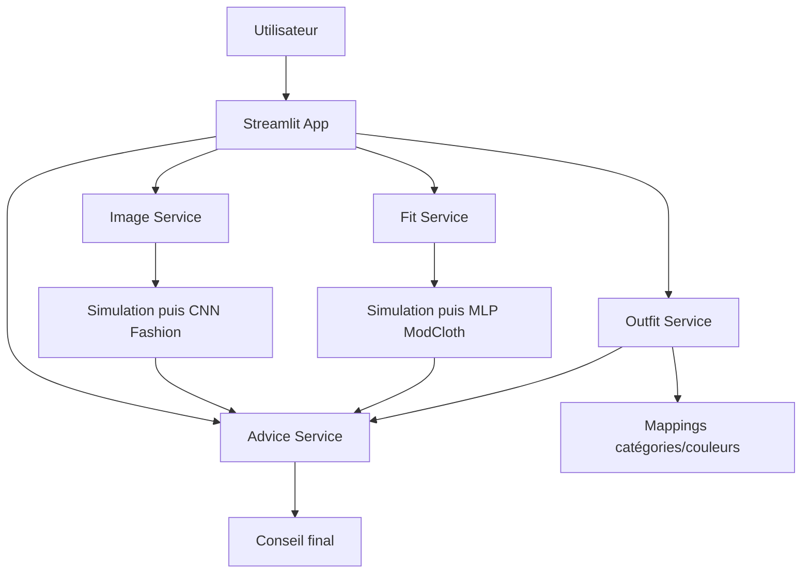

# Architecture MVP



## Principe

Streamlit ne doit pas contenir la logique métier. Il doit uniquement :

1. collecter les entrées utilisateur ;
2. appeler les services ;
3. afficher les résultats.

Les services doivent être réutilisables plus tard par FastAPI.

## Future API cible

```text
POST /predict/image
POST /predict/fit
POST /recommend/outfit
POST /advice/final
```
