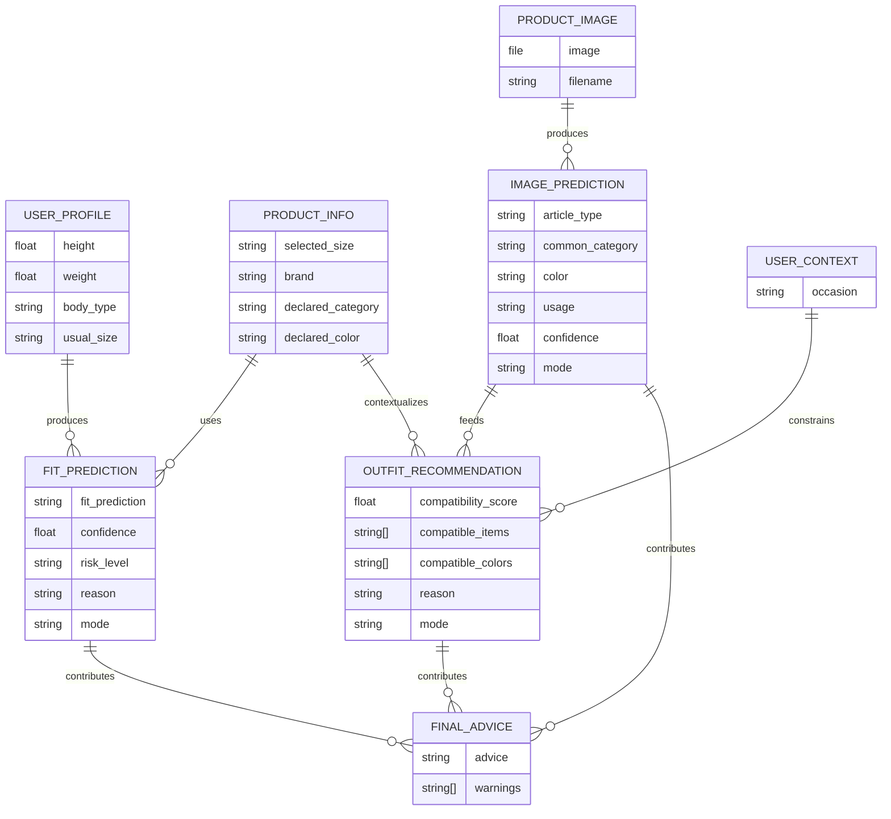

# PROJECT_CONTEXT — Fit & Outfit Advisor

## Sources de vérité
- `cahierdescharges-tensor.pdf` : objectif technique, contraintes pédagogiques, datasets, modèles, évaluation, MVP/avancé, livrables.
- `doc-technique.pdf` : stratégie front précoce, communication inter-modules, formats de sortie, architecture Streamlit évolutive vers FastAPI/React.
- Contexte préparatoire projet : priorité MVP, services séparés, Streamlit simulé déjà créé, logique métier hors UI.

## Résumé du produit
Fit & Outfit Advisor est un prototype IA d’aide au choix vestimentaire en ligne. Il combine :
1. reconnaissance d’un vêtement depuis une image produit ;
2. prédiction du risque de taille (`small` / `fit` / `large`) ;
3. suggestion ou évaluation d’associations vestimentaires ;
4. génération d’un conseil final simple, compréhensible et exploitable.

Le produit doit être présenté comme un système modulaire hybride : vision par ordinateur + classification tabulaire + règles de recommandation + explication utilisateur. Ne jamais le présenter comme une IA magique ou un styliste généraliste omniscient.

## Objectif de la V0
V0 = prototype universitaire démontrable et évalué, pas SaaS complet.

La V0 validée doit contenir :
- une application Streamlit testable ;
- un modèle TensorFlow/Keras tabulaire sur ModCloth pour prédire le fit ;
- un modèle TensorFlow/Keras image sur Fashion Product Images Small pour reconnaître un vêtement ;
- un module d’association de tenue par règles simples / mapping, pas obligatoirement un modèle Polyvore ;
- un moteur de conseil final combinant image + fit + association + contexte ;
- métriques et interprétation : accuracy, loss, matrice de confusion, courbes ou analyses d’erreurs ;
- notebooks ou scripts reproductibles ;
- README + mini-rapport 2 à 3 pages.

Prototype initial accepté : Streamlit peut utiliser des prédictions simulées tant que les services sont prêts à recevoir les vrais modèles.

## Wedge / cible initiale
Cible initiale : utilisateur qui achète un vêtement en ligne et veut savoir :
- quel type de vêtement est détecté ;
- si la taille choisie semble adaptée ;
- avec quelles pièces simples l’associer ;
- quel conseil d’achat en tirer.

Wedge fonctionnel : un parcours unique `image produit + profil utilisateur + taille choisie + contexte -> recommandation finale`.

Contexte pédagogique : MIAGE M2, cours réseaux de neurones / TensorFlow. Optimiser pour démonstration claire, explicabilité et faisabilité.

## Stack officielle
### Entraînement
- Google Colab prioritaire ; Kaggle Notebook possible pour accès datasets Kaggle.
- Python, TensorFlow/Keras, Pandas, NumPy, Scikit-learn, Matplotlib.
- Export modèles : `.keras`.
- Export preprocessing : `.pkl` ou `.joblib` pour encodeurs/scalers.

### Prototype applicatif V0
- Streamlit, Python, TensorFlow, Pillow, Pandas, Scikit-learn.
- Chargement local des modèles et artefacts de preprocessing.

### Évolution future seulement après V0
- FastAPI, React/Next.js, Docker, PostgreSQL, Cloud Run/VM.
- Endpoints envisagés : `POST /predict/image`, `POST /predict/fit`, `POST /recommend/outfit`, `POST /advice/final`.

## Principes d’architecture
- Architecture modulaire orientée services ; Streamlit = adapter UI uniquement.
- La logique métier et IA vit dans `src/services`, `src/preprocessing`, `src/mappings`, `src/models`.
- Les services doivent être appelables demain par FastAPI sans réécrire la logique.
- Communication inter-modules via sorties JSON/dict standardisées.
- Mappings communs obligatoires pour aligner les vocabulaires des datasets.
- Données brutes et datasets lourds hors logique applicative ; ne pas embarquer Kaggle datasets dans Git.
- Un modèle entraîné ne suffit pas : conserver aussi preprocessing, encodeurs, scalers, labels et versions.
- Préférer un pipeline petit mais stable à un système large incomplet.

Structure cible V0 :
```text
fit-outfit-advisor/
├── app/
│   └── streamlit_app.py
├── src/
│   ├── services/
│   │   ├── image_service.py
│   │   ├── fit_service.py
│   │   ├── outfit_service.py
│   │   └── advice_service.py
│   ├── mappings/
│   │   ├── category_mapping.py
│   │   └── color_mapping.py
│   ├── preprocessing/
│   │   ├── image_preprocessing.py
│   │   └── tabular_preprocessing.py
│   ├── models/
│   │   ├── load_image_model.py
│   │   └── load_fit_model.py
│   └── schemas/
│       └── prediction_schemas.py
├── models/
│   ├── fashion_model.keras
│   ├── fit_model.keras
│   └── encoders/
├── notebooks/
│   ├── 01_train_fit_model_colab.ipynb
│   ├── 02_train_fashion_model_colab.ipynb
│   └── 03_polyvore_exploration_colab.ipynb
├── data/{raw,processed,samples}/
├── reports/figures/
├── tests/
└── README.md
```

## Taxonomie utile du produit
### Compétences / capacités système
- `image_recognition` : identifier catégorie/type/couleur/usage depuis image produit.
- `fit_prediction` : prédire `small`, `fit`, `large` depuis profil + vêtement.
- `outfit_recommendation` : suggérer des associations cohérentes par règles/mapping.
- `advice_generation` : produire un conseil final synthétique et explicable.
- `evaluation_reporting` : produire métriques, figures et interprétation.

### Thèmes produit
- achat vêtement en ligne ;
- ajustement de taille ;
- classification d’image ;
- recommandation vestimentaire ;
- conseil explicable ;
- prototype pédagogique TensorFlow.

### Taxonomie image V0
- `product_type_v0` : sortie detaillee predite par le CNN, derivee de `styles.csv.articleType`.
- `canonical_category` : role metier derive deterministiquement apres prediction, utilise par le moteur outfit.
- Classes `product_type_v0` V1.1 validees : `tshirt`, `shirt`, `top`, `jeans`, `trousers`, `shorts`, `dress`, `outerwear`, `casual_shoes`, `sports_shoes`, `dress_shoes`, `sandals`, `flip_flops`, `heels`, `bag`, `watch`, `sunglasses`, `wallet`, `belt`, `jewellery`.
- Categories metier derivees : `top`, `bottom`, `dress`, `shoes`, `outerwear`, `bag`, `accessory`, `unknown`.
- Les accessoires visuellement differents comme `watch`, `jewellery`, `sunglasses`, `wallet` et `belt` restent des sorties CNN distinctes.
- Les chaussures visuellement differentes comme `casual_shoes`, `sports_shoes`, `dress_shoes`, `sandals`, `flip_flops` et `heels` restent des sorties CNN distinctes. `Flats` est conserve comme `articleType` source mais mappe vers `dress_shoes` en V1.1.
- `unknown` : product type non mappe, categorie non mappable ou confiance insuffisante.

### Objets métier / données runtime
- `UserProfile` : taille, poids, body_type, taille habituelle éventuelle.
- `ProductInfo` : taille choisie, marque optionnelle, catégorie éventuelle, couleur éventuelle.
- `ProductImage` : image uploadée, format PIL/tensor après preprocessing.
- `ImagePrediction` : article/type/catégorie/couleur/usage/confiance/mode.
- `FitPrediction` : prédiction fit/confiance/risk_level/reason/mode.
- `OutfitRecommendation` : score, pièces compatibles, couleurs compatibles, raison/mode.
- `FinalAdvice` : conseil utilisateur final + avertissements si confiance faible.
- `ModelArtifact` : modèle `.keras` + label encoder + scaler/encoder + metadata.

## MCD / modèle conceptuel V0
Pas de base de données obligatoire en V0. Le MCD sert à stabiliser les objets manipulés en mémoire et les contrats futurs API.



## Grands modules / bounded contexts
### 1. UI Adapter — Streamlit
Responsabilité : capturer image, profil, taille, contexte ; afficher résultats lisibles ; exposer détails techniques en option.
Interdit : entraîner modèles, contenir règles métier, encoder données, décider seule du conseil.

### 2. Image Recognition Context
Responsabilité : transformer image -> prédiction standardisée.
V0 modèle : CNN simple ou MobileNetV2 transfer learning sur Fashion Product Images Small.
Sortie cible apprise : `product_type_v0`.
Sortie derivee : `canonical_category`, calculee apres prediction pour le moteur outfit.
Hors cible V0 : `baseColour`, `usage` et classification simultanee multi-sorties.

### 3. Fit Prediction Context
Responsabilité : transformer profil utilisateur + vêtement -> `small` / `fit` / `large`.
V0 modèle : MLP TensorFlow/Keras sur ModCloth / Clothing Fit Data.
Dépendances critiques : preprocessing tabulaire, encodeurs, scaler, ordre exact des features.

### 4. Outfit Recommendation Context
Responsabilité : proposer des associations simples et cohérentes.
V0 : règles par catégorie/couleur/contexte + associations fréquentes inspirées Polyvore.
Bonus : modèle TensorFlow binaire Polyvore seulement si Image + Fit + Streamlit + rapport sont stables.

### 5. Advice Context
Responsabilité : agréger résultats et produire un conseil final court, clair, actionnable, explicable.
Ne doit pas masquer les faibles confiances ou les limites.

### 6. Shared Vocabulary / Mapping Context
Responsabilité : maintenir `category_mapping.py`, `color_mapping.py`, labels communs.
Invariants : aucun module ne doit supposer que les labels Kaggle/ModCloth/Polyvore sont identiques.

### 7. Training & Evaluation Context
Responsabilité : notebooks Colab/Kaggle, preprocessing, entraînement, sauvegarde, métriques, figures rapport.
Doit produire des artefacts réutilisables par l’application.

## Flux métier clés V0
### Flux A — Prototype simulé précoce
1. Utilisateur upload image + saisit profil/taille/contexte.
2. Services retournent sorties simulées au format contractuel.
3. Advice Service génère conseil final.
4. UI affiche cartes lisibles + JSON technique optionnel.

But : tester parcours utilisateur et contrats avant modèles réels.

### Flux B — Prédiction du fit réelle
1. Streamlit collecte `UserProfile` + `ProductInfo`.
2. `fit_service` charge modèle + scaler + encodeurs.
3. `tabular_preprocessing` transforme les inputs dans le même ordre qu’à l’entraînement.
4. MLP prédit probas `small/fit/large`.
5. Service retourne `FitPrediction` standardisé.

### Flux C — Reconnaissance image réelle
1. Streamlit reçoit image.
2. `image_preprocessing` resize + normalise + ajoute batch dimension.
3. `image_service` charge CNN + label encoder.
4. Modèle prédit `product_type_v0` ; mapping déterministe vers `canonical_category`.
5. Service retourne `ImagePrediction` standardisé.

### Flux D — Association + conseil final
1. `outfit_service` reçoit catégorie commune + couleur + contexte.
2. Applique règles compatibilité catégorie/couleur/contexte.
3. Retourne score + suggestions + raison.
4. `advice_service` combine image + fit + outfit.
5. Produit conseil final en langage utilisateur.

### Flux E — Entraînement -> export -> intégration
1. Notebook charge dataset.
2. Nettoyage + split train/validation/test.
3. Modèle TensorFlow entraîné.
4. Évaluation + figures.
5. Export `.keras` + `.joblib/.pkl`.
6. Test de chargement local dans service.

## Règles métier transversales à ne pas violer
- Le conseil final doit être compréhensible par un non-technicien.
- Toujours distinguer résultat prédit, niveau de confiance et conseil.
- Si confiance faible, afficher un avertissement ou formuler prudemment.
- Le fit est une estimation, pas une garantie : la subjectivité des retours clients doit être assumée.
- La recommandation tenue V0 doit rester simple : catégories, couleurs, contexte.
- Le contexte utilisateur influence le conseil : casual, travail, soirée, sport, entretien si ajouté.
- Les sorties doivent rester exploitables même si un module est simulé ou indisponible.
- Le module Polyvore ne doit pas bloquer la V0.
- La priorité de valeur : fit MLP + image CNN + conseil final > Polyvore avancé > FastAPI/React.
- Ne pas coder une UI séduisante au détriment de l’évaluation ML.

## Règles IA / LLM
- TensorFlow/Keras est obligatoire pour les modèles prédictifs V0.
- Aucun LLM n’est requis en V0 ; ne pas ajouter de dépendance LLM sans arbitrage explicite.
- Si un LLM est ajouté plus tard pour reformuler le conseil :
  - il ne remplace pas les modèles prédictifs ;
  - il reçoit uniquement des résultats structurés validés ;
  - il ne doit pas inventer de taille, couleur, catégorie, score ou justification ;
  - ses sorties doivent être bornées par des règles métier et testables.
- Le conseil ne doit pas masquer l’incertitude des modèles.
- Les labels et probabilités doivent provenir des modèles ou règles, pas d’une génération libre.
- Toute sortie IA doit indiquer `mode`: `simulation`, `tensorflow`, `rule_based_mvp` ou équivalent.

## Règles qualité / développement
- Fonctions services pures autant que possible : inputs explicites, outputs standardisés.
- Pas de logique métier lourde dans `streamlit_app.py`.
- Ne pas dupliquer les mappings dans plusieurs fichiers.
- Gérer les erreurs : image absente, modèle absent, artefact absent, catégorie inconnue, input incomplet.
- Ajouter des tests unitaires sur services, mappings, advice, preprocessing minimal.
- Ajouter tests smoke : imports, lancement services simulés, chargement modèle si artefacts présents.
- Chemins portables via `pathlib`, pas de chemins Colab codés en dur dans l’app.
- Notebooks reproductibles : seed, versions, étapes visibles, export clair.
- Sauvegarder ensemble modèle + preprocessing + labels + metadata.
- Métriques et matrices de confusion obligatoires pour les modèles réels.
- Les datasets et gros artefacts ne doivent pas être committés sans nécessité.

## Stratégie de test V0
### Tests unitaires
- `category_mapping`: labels connus -> catégories communes ; labels inconnus -> `unknown`.
- `color_mapping`: couleurs connues -> familles compatibles ; inconnues -> fallback.
- `advice_service`: conseil cohérent pour `small`, `fit`, `large`, confiance faible.
- `outfit_service`: suggestions non vides pour catégories principales.
- `preprocessing`: shapes image attendues, vecteur tabulaire stable.

### Tests d’intégration
- Parcours simulé complet : image dummy + profil -> conseil final.
- Service fit réel si modèle présent : input exemple -> dict conforme.
- Service image réel si modèle présent : image sample -> dict conforme.

### Tests modèle / notebooks
- Split train/validation/test documenté.
- Courbes loss/accuracy sauvegardées.
- Matrice de confusion sauvegardée.
- Classification report pour fit.
- Analyse qualitative : bonnes/mauvaises prédictions.

### Critère d’acceptation V0
Une personne peut lancer Streamlit, tester un cas complet, voir les prédictions, comprendre le conseil, et consulter les métriques dans notebooks/rapport.

## Contraintes et zones sensibles
- Périmètre court : mini-projet + mini-rapport 2 à 3 pages ; éviter l’usine à gaz.
- Datasets hétérogènes : labels, catégories, couleurs et usages ne sont pas naturellement alignés.
- Fashion Product Images : classes potentiellement déséquilibrées ; filtrer classes rares ; limiter classes V0.
- Image : couleur réelle depuis pixels peut être complexe ; utiliser `baseColour` metadata si nécessaire pour V0.
- ModCloth : fit subjectif, classes déséquilibrées, valeurs manquantes, tailles/poids à nettoyer.
- Polyvore : modèle supervisé demande création rigoureuse de négatifs ; risque élevé pour V0.
- Colab/Kaggle : sessions temporaires, chemins variables ; exporter proprement les artefacts.
- Streamlit : rapide mais peut encourager une logique spaghetti ; maintenir séparation stricte.
- Évaluation : accuracy seule insuffisante si classes déséquilibrées ; ajouter précision/rappel/matrice de confusion.
- Explicabilité : présenter limites et erreurs, pas seulement meilleur score.

## Hors périmètre V0
- Application SaaS production.
- Comptes utilisateurs, authentification, profils persistants.
- Base PostgreSQL ou stockage long terme.
- Paiement, abonnement, billing, analytics produit.
- Scraping e-commerce, stocks, prix, panier d’achat.
- React/Next.js + FastAPI en production.
- Docker/deploiement cloud obligatoire.
- Système LLM libre de conseil mode.
- Recommandation personnalisée long terme selon historique utilisateur.
- Modèle TensorFlow Polyvore obligatoire.
- Comparaison automatique multi-tailles avancée.
- Export du conseil, sauvegarde préférences, catalogue réel.

## Hypothèses / points à arbitrer
- Classes image V1.1 : 20 classes fréquentes, lisibles et visuellement séparables, avec seuil minimal `450` images lisibles.
- Cible image principale : `product_type_v0`, derivee de `articleType` ; `canonical_category` est derivee ensuite pour le moteur outfit ; `baseColour`/`usage` restent hors cible V0.
- Architecture image : CNN simple pour cohérence cours vs MobileNetV2 pour robustesse. Arbitrer selon temps/performance.
- Variables ModCloth réellement disponibles : confirmer colonnes (`height`, `weight`, `body type`, `size`, `category`, `rating`, `fit`).
- Stratégie classes fit : garder `small/fit/large` ou regrouper selon distribution réelle.
- Seuils de confiance à afficher : définir faible/moyen/élevé.
- Niveau de Polyvore V0 : règles codées manuellement vs associations extraites automatiquement.
- Format exact des schémas : dict simple suffisant V0 ; Pydantic utile si FastAPI ensuite.
- Ordre final des notebooks : harmoniser noms existants avec ordre de développement réel.

## Ordre de développement recommandé
1. Stabiliser Streamlit simulé + contrats de sortie.
2. Stabiliser mappings catégories/couleurs.
3. Entraîner ModCloth MLP ; exporter `.keras` + preprocessing.
4. Intégrer vrai `fit_service`.
5. Entraîner Fashion CNN ; exporter `.keras` + label encoder.
6. Intégrer vrai `image_service`.
7. Renforcer `outfit_service` règles catégorie/couleur/contexte.
8. Renforcer `advice_service` avec confiance, warnings, explication.
9. Produire figures/métriques/rapport.
10. Bonus seulement : Polyvore avancé ou FastAPI/React.

## Formats de sortie standardisés
### ImagePrediction
```json
{
  "product_type": "shirt",
  "canonical_category": "top",
  "predicted_class": "shirt",
  "common_category": "top",
  "confidence": 0.87,
  "model_status": "tensorflow",
  "mode": "tensorflow"
}
```

### FitPrediction
```json
{
  "fit_prediction": "fit",
  "confidence": 0.74,
  "risk_level": "low",
  "reason": "La taille choisie semble cohérente avec le profil.",
  "mode": "tensorflow"
}
```

### OutfitRecommendation
```json
{
  "compatibility_score": 0.82,
  "compatible_items": ["beige trousers", "brown shoes"],
  "compatible_colors": ["beige", "brown", "white"],
  "reason": "Association sobre adaptée au contexte.",
  "mode": "rule_based_mvp"
}
```

### FinalAdvice
```json
{
  "advice": "Ce vêtement semble adapté et peut être associé avec un pantalon beige.",
  "warnings": []
}
```

## Glossaire opérationnel minimal
- `fit` : classe cible signifiant taille estimée adaptée, pas ajustement parfait garanti.
- `small` : risque que la taille soit trop petite.
- `large` : risque que la taille soit trop grande.
- `articleType` : label détaillé Fashion Product Images, ex. Shirts/Tshirts/Jeans.
- `common_category` : catégorie interne normalisée, ex. top/bottom/dress/shoes.
- `usage` : contexte d’usage issu dataset ou règle, ex. casual/formal/sports.
- `compatibility_score` : score interne de cohérence tenue ; en V0, souvent rule-based, pas probabilité statistique.
- `mode` : origine de la sortie : simulation, tensorflow, rule_based_mvp.
- `artefact` : fichier nécessaire à l’inférence : modèle, encoder, scaler, labels, metadata.

## Mise a jour priorite - Fashion CNN V0
- Le module ModCloth est cloture comme experimentation academique non promouvable dans l'etat actuel.
- La nouvelle priorite est le pipeline image Fashion Product Images Small.
- La cible apprise par le CNN image V0 est `product_type_v0`, derivee de `styles.csv.articleType`.
- `canonical_category` est un role metier derive apres prediction pour les regles outfit.
- Le modele ne doit pas apprendre simultanement `articleType`, couleur ou usage en V0.
- Classes `product_type_v0` validees :
  - vetements : `tshirt`, `shirt`, `top`, `jeans`, `trousers`, `shorts`, `dress`, `outerwear` ;
  - chaussures : `casual_shoes`, `sports_shoes`, `dress_shoes`, `sandals`, `flip_flops`, `heels` ;
  - accessoires : `bag`, `watch`, `sunglasses`, `wallet`, `belt`, `jewellery`.
- Decision V1.1 : `Flats` n'est plus une sortie visible ; `articleType = "Flats"` est mappe vers `dress_shoes` apres analyse du premier entrainement.
- Resultat experimental V1.1 : MobileNetV2, accuracy test `0.8748`, balanced accuracy test `0.8483`, macro F1 test `0.8526`.
- Avant promotion, executer `src.analysis.analyze_fashion_v1_abstention` pour choisir un seuil de confiance sur validation uniquement.
- Fashion V1.1 est promu localement dans `models/fashion_active/` avec seuil d'abstention `0.90`.
- Au seuil `0.90`, le test donne coverage `0.7083`, unknown rate `0.2917`, accuracy non-unknown `0.9695`, macro F1 non-unknown `0.9425`.
- Categories canoniques derivees : `top`, `bottom`, `dress`, `shoes`, `outerwear`, `bag`, `accessory`.
- Le mapping officiel est porte par `config/fashion_v1_classes.json`.
- Ce mapping est en statut `validated_for_training` apres audit dataset.
- Le pipeline impose est :
  - `styles.csv` ;
  - mapping `articleType` vers `product_type_v0` ;
  - mapping deterministe `product_type_v0` vers `canonical_category` ;
  - exclusion des labels non retenus ;
  - verification image presente et lisible ;
  - comptage final par classe ;
  - seuil minimal documente par classe ;
  - split stratifie.
- `models/fashion_v1/` est experimental.
- `models/fashion_active/` est le seul emplacement actif image et exige `model_status: "promoted"` avec `promotable_to_streamlit: true`.
- Un modele image promu devra definir `abstention_strategy.minimum_confidence`; sous ce seuil, `image_service` retourne `product_type: "unknown"`.
- `image_service` doit rester en fallback simule tant qu'aucun artefact image actif n'est promu.

## Mise a jour priorite - Outfit Compatibility V0
- Prochain module : audit Polyvore et baseline cooccurrence.
- Le module outfit doit rester aligne avec Fashion V1.1 : `product_type_v0`, `canonical_category`, `outfit_role`.
- Polyvore ne doit pas introduire de taxonomie independante ; tout label Polyvore doit passer par un mapping explicite.
- Premier livrable : `docs/working/OUTFIT_COMPATIBILITY_V0_PLAN.md`, `config/outfit_v1_config.json`, `notebooks/03_polyvore_exploration_colab.ipynb`.
- Source principale audit : Hugging Face `mvasil/polyvore-outfits`, via le secret Colab `HUGGIN_KEY`.
- Le notebook doit privilegier les configurations/splits `disjoint` et `nondisjoint` si disponibles et sauvegarder une copie dans Google Drive.
- Aucun entrainement TensorFlow outfit avant audit dataset et validation du mapping.
- `models/outfit_v1/` est experimental ; `models/outfit_active/` sera le seul emplacement actif futur.
